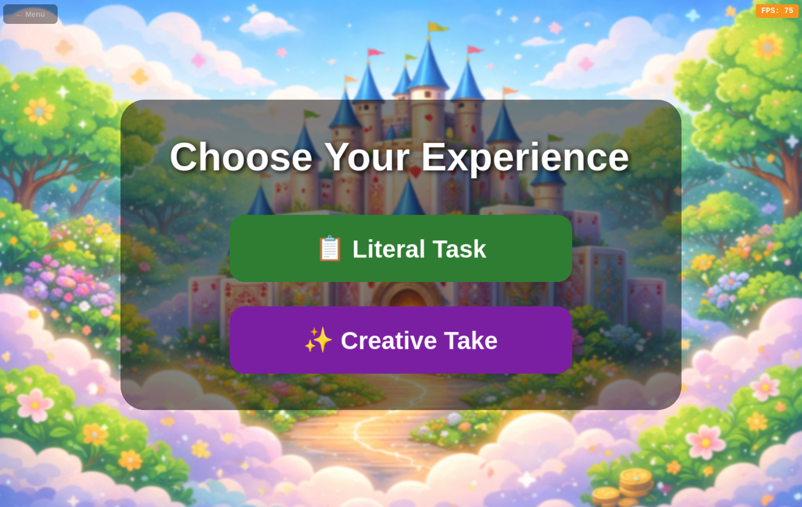
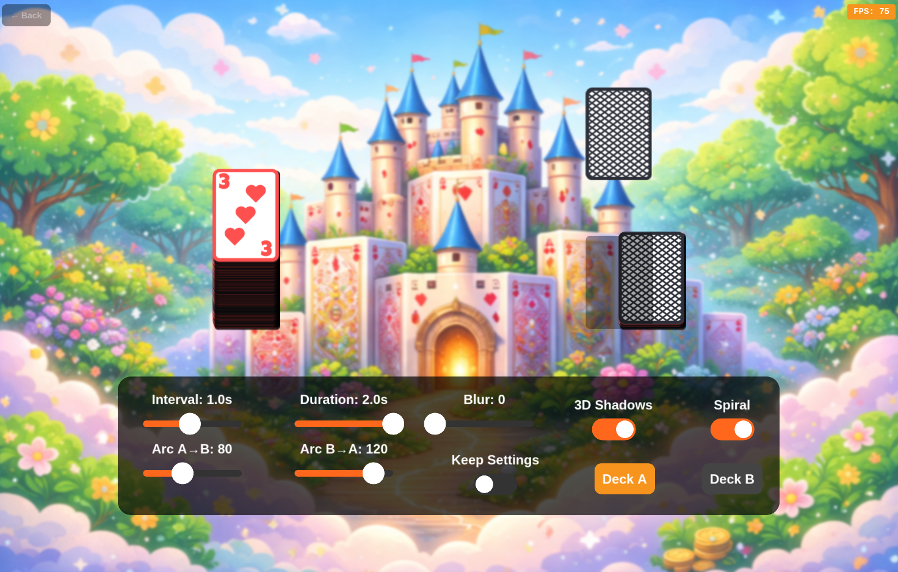
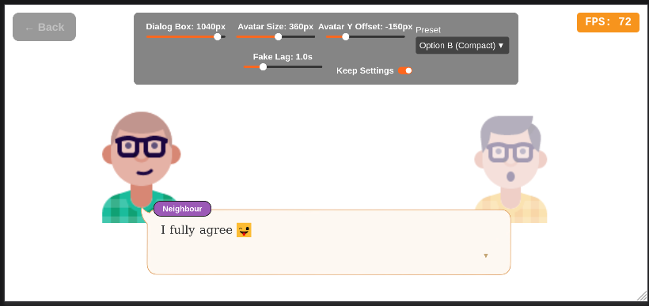
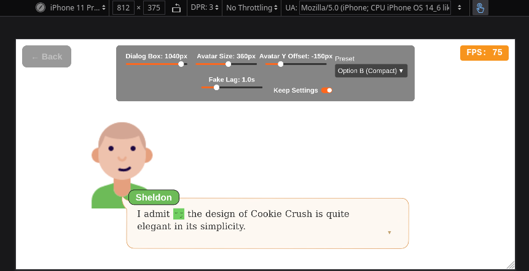
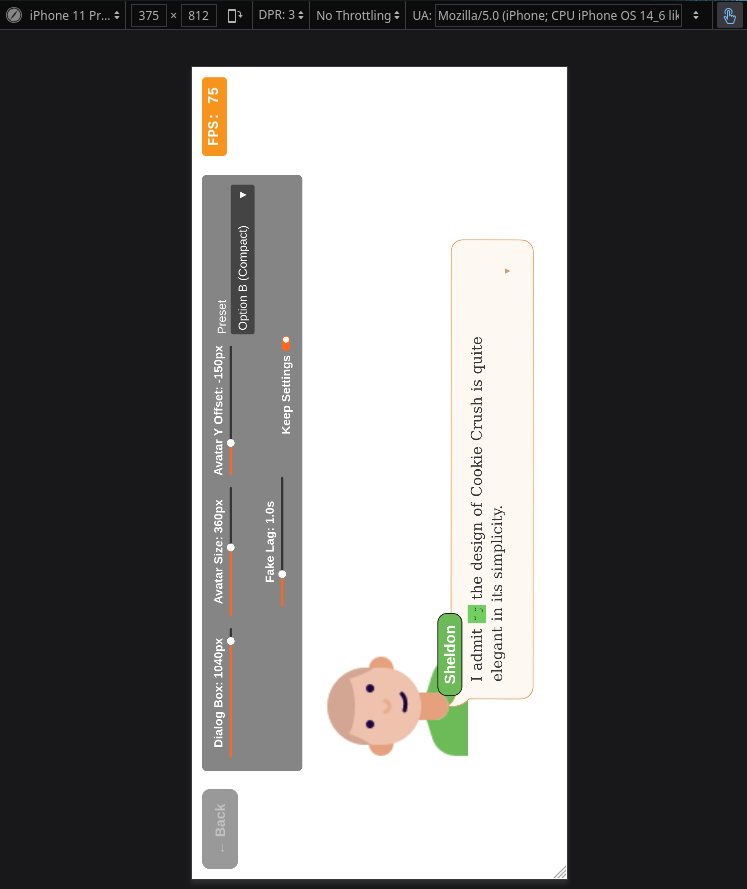
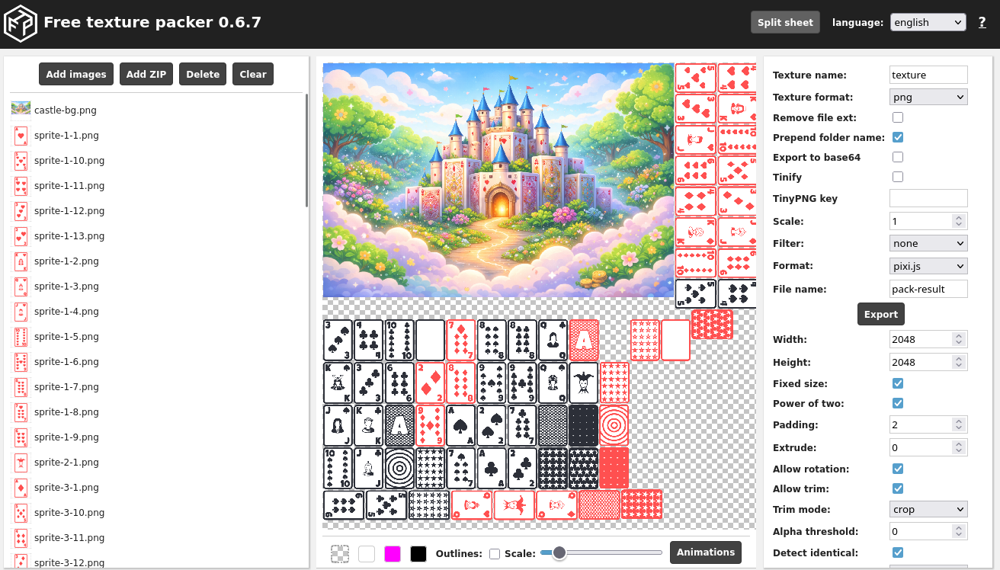

# BESTGAMES - Game Developer Tasks

A unified PixiJS application featuring three interactive demos, built as a technical assessment for Senior HTML5 Game Developer.

**Author:** Javier Moreno

## 🎮 Live Demo

👉 **[Play the Demo](https://javideas.github.io/Game-Developer-Tasks/)** *(coming soon)*

---

## 🕹️ The Three Tasks

| # | Name | Description | Status |
|---|------|-------------|--------|
| 1 | **Ace of Shadows** | 144 animated cards moving between two stacks with 3D shadows | ✅ Complete |
| 2 | **Magic Words** | Visual novel dialogue with inline emojis and API integration | ✅ Complete |
| 3 | **Phoenix Flame** | Particle-based fire effect (max 10 sprites) | 🚧 Coming soon |

All tasks are accessible via an in-game menu with FPS counter.

---

## 🛠️ Tech Stack

| Technology | Version | Purpose |
|------------|---------|---------|
| PixiJS | v7.4.3 | WebGL 2D rendering |
| TypeScript | 5.9 | Type-safe code |
| GSAP | 3.14 | Smooth animations |
| Vite | 7.2 | Build tool |

---

## 🚀 Getting Started

```bash
# Clone the repository
git clone https://github.com/javideas/Game-Developer-Tasks.git
cd Game-Developer-Tasks

# Install dependencies
npm install

# Start development server
npm run dev
```

Open `http://localhost:5173` in your browser.

---

## 📁 File Architecture

```
src/
├── main.ts                          # Entry point, scene navigation
├── style.css                        # Global styles (fullscreen canvas, FPS)
│
├── config/
│   ├── design.ts                    # Main menu UI constants
│   ├── sharedSettings.ts            # Cross-task responsive breakpoints
│   ├── aceOfShadowsSettings.ts      # Task 1: Ace of Shadows config
│   └── magicWordsSettings.ts        # Task 2: Magic Words config
│
├── core/
│   ├── index.ts                     # Barrel exports
│   ├── Application.ts               # PixiJS wrapper, resize handling
│   ├── SceneManager.ts              # Scene lifecycle (start, stop, update)
│   └── FPSCounter.ts                # FPS display (HTML overlay, top-right)
│
├── components/
│   ├── Button.ts                    # Reusable button with hover effects
│   ├── MenuTile.ts                  # Game thumbnail tile with hover overlay
│   ├── Slider.ts                    # Value slider control
│   ├── Toggle.ts                    # Boolean toggle control
│   ├── Dropdown.ts                  # Dropdown menu control
│   ├── SettingsPanel.ts             # Cell-based settings layout
│   ├── GameSettingsPanel.ts         # Abstract base for game settings UI
│   ├── ModeSelectionPanel.ts        # Mode selection UI component
│   ├── RichText.ts                  # Text with inline emoji images
│   └── SpeechBubble.ts              # 9-slice speech bubble component
│
├── scenes/
│   ├── BaseGameScene.ts             # Abstract base class for game scenes
│   ├── MainMenuScene.ts             # Main menu with game tiles
│   ├── AceOfShadowsScene.ts         # Task 1: Scene coordinator
│   ├── MagicWordsScene.ts           # Task 2: Scene coordinator
│   └── PhoenixFlameScene.ts         # Task 3: Particle fire effect
│
├── modes/
│   ├── GameMode.ts                  # Interface for game mode implementations
│   ├── aceOfShadows/
│   │   ├── index.ts                 # Barrel exports
│   │   ├── AceOfShadowsModeLiteral.ts   # Literal mode implementation
│   │   ├── AceOfShadowsModeCreative.ts  # Creative mode placeholder
│   │   └── LiteralModeSettingsPanel.ts  # Literal mode settings UI
│   │
│   └── magicWords/
│       ├── index.ts                 # Barrel exports
│       ├── MagicWordsModeLiteral.ts     # Visual novel dialogue system
│       ├── MagicWordsModeCreative.ts    # Creative mode placeholder
│       └── MagicWordsSettingsPanel.ts   # Dialogue settings UI
│
└── assets/
    ├── fonts/
    └── sprites/
        ├── thumbnails/              # Game preview images
        ├── dialog/                  # Speech bubble assets
        └── ultimate-minimalist-card-asset/  # Card spritesheet
```

---

## 🏗️ Core Architecture

```
┌─────────────────────────────────────────────────────────────────────────┐
│                              main.ts                                    │
│                           (Entry Point)                                 │
│                                 │                                       │
│                                 ▼                                       │
│  ┌───────────────────────────────────────────────────────────────────┐  │
│  │                         Application                               │  │
│  │  ┌─────────────┐  ┌─────────────┐  ┌─────────────────────────┐    │  │
│  │  │ PixiJS App  │  │ FPSCounter  │  │     SceneManager        │    │  │
│  │  │  (canvas)   │  │ (top-right) │  │ (lifecycle management)  │    │  │
│  │  └─────────────┘  └─────────────┘  └───────────┬─────────────┘    │  │
│  └────────────────────────────────────────────────┼──────────────────┘  │
│                                                   │                     │
│                                                   ▼                     │
│  ┌───────────────────────────────────────────────────────────────────┐  │
│  │                       Scene Interface                             │  │
│  │  • container: Container     • onStart(): Promise<void>            │  │
│  │  • onStop(): void           • onResize(): void                    │  │
│  │  • onUpdate(delta): void    • destroy(): void                     │  │
│  └───────────────────────────────────────────────────────────────────┘  │
│                                                                         │
│              ┌─────────────────────┬────────────────────┐               │
│              ▼                     ▼                    ▼               │
│     ┌──────────────┐    ┌─────────────────────┐  ┌──────────────┐       │
│     │  MainMenu    │    │   BaseGameScene     │  │ (more scenes)│       │
│     │   Scene      │    │     (abstract)      │  │              │       │
│     │              │    │ • gameContainer     │  │              │       │
│     │ • MenuTiles  │    │ • responsive layout │  │              │       │
│     │ • Title bar  │    │ • device detection  │  │              │       │
│     └──────────────┘    │ • back button       │  └──────────────┘       │
│                         │ • auto-rotation     │                         │
│                         └──────────┬──────────┘                         │
│                                    │                                    │
│              ┌─────────────────────┼─────────────────────┐              │
│              ▼                     ▼                     ▼              │
│     ┌────────────────┐  ┌────────────────┐  ┌────────────────┐          │
│     │ AceOfShadows   │  │  MagicWords    │  │ PhoenixFlame   │          │
│     │    Scene       │  │    Scene       │  │    Scene       │          │
│     │  (coordinator) │  │                │  │                │          │
│     └───────┬────────┘  └────────────────┘  └────────────────┘          │
│             │                                                           │
│             ▼                                                           │
│     ┌───────────────────────────────────────────────────────┐           │
│     │                  Mode Composition                     │           │
│     │  ┌─────────────────┐    ┌─────────────────────────┐   │           │
│     │  │   GameMode      │    │  GameModeContext        │   │           │
│     │  │   Interface     │◀──│  (shared resources)     │   │           │
│     │  │ • start()       │    │  • container            │   │           │
│     │  │ • stop()        │    │  • spritesheet          │   │           │
│     │  │ • onResize()    │    │  • gameContainer        │   │           │
│     │  │ • onDeviceState │    │  • requestLayout()      │   │           │
│     │  └────────┬────────┘    └─────────────────────────┘   │           │
│     │           │                                           │           │
│     │     ┌─────┴─────┐                                     │           │
│     │     ▼           ▼                                     │           │
│     │ ┌─────────┐ ┌─────────┐                               │           │
│     │ │ Literal │ │Creative │                               │           │
│     │ │  Mode   │ │  Mode   │                               │           │
│     │ └─────────┘ └─────────┘                               │           │
│     └───────────────────────────────────────────────────────┘           │
└─────────────────────────────────────────────────────────────────────────┘
```

---

## 🎯 Ace of Shadows





### Mode Composition Pattern

The Ace of Shadows scene uses a **Mode Composition Pattern** where the scene acts as a coordinator and delegates game logic to separate mode classes:

```
AceOfShadowsScene (coordinator, ~270 lines)
├── Loads shared resources (spritesheet, background)
├── Displays mode selection UI
├── Creates GameModeContext for mode instances
└── Forwards lifecycle events to active mode

AceOfShadowsModeLiteral (~1000 lines)
├── 144 cards in two stacks
├── Animation system (linear/spiral modes)
├── 3D shadow system (floor + stack shadows)
└── Settings panel (delegates to LiteralModeSettingsPanel)

AceOfShadowsModeCreative (~70 lines)
└── Placeholder for creative implementation
```

### Settings Panel Hierarchy

```
GameSettingsPanel (abstract base)
├── Auto-sizing background panel
├── Responsive scaling to screen space
├── Device state handling (phone/tablet/desktop)
│
└── LiteralModeSettingsPanel (extends GameSettingsPanel)
    ├── Sliders: Interval, Duration, Blur, Arc A→B, Arc B→A
    ├── Toggles: 3D Shadows, Spiral, Keep Settings
    └── Deck toggle buttons: Deck A, Deck B
```

### Animation Modes

| Mode | Description |
|------|-------------|
| **Linear** | Cards move in straight line between stacks |
| **Spiral** | Cards arc upward and flip mid-air (face ↔ back) |

### 3D Shadow System

```
Moving Card
    │
    ├── Floor Shadow (behind everything)
    │   • Always at floor level
    │   • Follows card X position
    │   • Shrinks/expands with card flip
    │
    └── Stack Shadow (on top card of stack)
        • Masked by card shape
        • Only visible when card is above stack
```

### Responsive Behavior

| Device State | Settings Layout |
|--------------|-----------------|
| Desktop/Tablet | 2 rows × 5 columns |
| Phone Landscape | 2 rows × 5 columns (larger) |
| Phone Portrait | 5 rows × 2 columns |

---

## 💬 Magic Words



### Visual Novel Dialogue System

Task 2 implements a visual novel-style dialogue system that fetches data from an API and renders text with inline emoji images.

```
MagicWordsScene (coordinator, ~220 lines)
├── Loads nothing upfront (API-driven)
├── Displays mode selection UI
├── Creates GameModeContext for mode instances
├── preferredOrientation: 'landscape' (auto-rotates on portrait phones)
└── Forwards lifecycle events to active mode

MagicWordsModeLiteral (~900 lines)
├── API data fetching (dialogue, emojis, avatars)
├── Visual novel layout (avatars + speech bubble)
├── RichText component for inline emojis
├── Click-to-advance dialogue system
├── Avatar bounce animations (appear/disappear/active speaker)
├── Dynamic avatar generation (DiceBear API for unknown speakers)
└── Settings panel (delegates to MagicWordsSettingsPanel)

MagicWordsSettingsPanel (~450 lines)
├── Extends GameSettingsPanel
├── Dialog box width, avatar size, Y offset sliders
├── Preset dropdown (A/B configurations)
├── Fake lag slider (debug loading screen)
├── Keep Settings toggle with persistence
├── Physical portrait UI multiplier (1.3×)
└── Responsive layout (vertical on portrait, horizontal on landscape)

MagicWordsModeCreative (~70 lines)
└── Placeholder for creative implementation
```

### Key Components

| Component | Purpose |
|-----------|---------|
| `RichText` | Parses `{emoji}` placeholders and renders inline images |
| `SpeechBubble` | 9-slice scalable bubble with configurable tail direction |
| `MagicWordsSettingsPanel` | Dialog/avatar size, Y offset, presets, fake lag |

### Responsive Behavior

| Device State | Settings Layout | UI Scale |
|--------------|-----------------|----------|
| Desktop/Tablet | 2 rows horizontal | 1.0× |
| Phone Landscape | 2 rows horizontal | 1.0× |
| Phone Portrait (physical) | Single column vertical | 1.3× |

Note: "Physical portrait" means the device is physically held in portrait, even though game content is rotated to landscape.

### API Integration

```typescript
// Fetches from API endpoint
const data = await fetch(API_URL).then(r => r.json());
// { dialogue: [...], emojies: [...], avatars: [...] }

// Dynamic avatar generation for missing speakers
generateAvatarUrl(name, color, position) // → DiceBear Personas URL
```

### Dialogue Flow

```
┌─────────────────────────────────────────────────┐
│                    Screen                       │
│                                                 │
│  ┌────────┐                        ┌────────┐   │
│  │ Avatar │                        │ Avatar │   │
│  │ (left) │                        │(right) │   │
│  │        │                        │        │   │
│  └────────┘                        └────────┘   │
│                                                 │
│  ┌─────────────────────────────────────────┐    │
│  │ [Speaker Name]                          │    │
│  │                                         │    │
│  │ "Dialogue text with {emoji} inline..."  │    │
│  │                                     ▼   │    │
│  └─────────────────────────────────────────┘    │
│                                                 │
│  Click anywhere to advance                      │
└─────────────────────────────────────────────────┘
```

### Settings Persistence

Like Ace of Shadows, Magic Words supports "Keep Settings" toggle:

```typescript
// Config exports
getDefaultSettings()      // Default values
getPreservedSettings()    // Saved values (or null)
saveSettings(partial)     // Persist to singleton
clearPreservedSettings()  // Reset
```

### Auto-Rotation for Portrait Devices

Magic Words is designed for landscape viewing. When played on a phone in portrait mode, the game content auto-rotates 90° while keeping UI overlays (back button, FPS counter) pinned to physical screen corners:




The settings panel also scales up by 1.3× in physical portrait mode for easier touch interaction.

---

## 📦 Key Components

### Core Classes

| Class | File | Responsibility |
|-------|------|----------------|
| `Application` | `core/Application.ts` | PixiJS init, resize, FPS, scenes |
| `SceneManager` | `core/SceneManager.ts` | Scene lifecycle management |
| `BaseGameScene` | `scenes/BaseGameScene.ts` | Abstract base with responsive layout, auto-rotation |

### Scene Classes

| Class | File | Responsibility |
|-------|------|----------------|
| `MainMenuScene` | `scenes/MainMenuScene.ts` | Menu UI with game tiles |
| `AceOfShadowsScene` | `scenes/AceOfShadowsScene.ts` | Task 1 coordinator |
| `MagicWordsScene` | `scenes/MagicWordsScene.ts` | Task 2 coordinator, auto-rotates to landscape |
| `PhoenixFlameScene` | `scenes/PhoenixFlameScene.ts` | Task 3 (coming soon) |

### Mode Classes

| Class | File | Responsibility |
|-------|------|----------------|
| `GameMode` | `modes/GameMode.ts` | Interface for mode implementations |
| `AceOfShadowsModeLiteral` | `modes/aceOfShadows/` | Card animation game logic |
| `AceOfShadowsModeCreative` | `modes/aceOfShadows/` | Creative mode (placeholder) |
| `LiteralModeSettingsPanel` | `modes/aceOfShadows/` | Ace of Shadows settings UI |
| `MagicWordsModeLiteral` | `modes/magicWords/` | Visual novel dialogue system |
| `MagicWordsModeCreative` | `modes/magicWords/` | Creative mode (placeholder) |
| `MagicWordsSettingsPanel` | `modes/magicWords/` | Magic Words settings UI |

### UI Components

| Class | File | Responsibility |
|-------|------|----------------|
| `Button` | `components/Button.ts` | Reusable button with hover |
| `Slider` | `components/Slider.ts` | Value slider, rotation-aware input |
| `Toggle` | `components/Toggle.ts` | Boolean toggle, horizontal layout |
| `Dropdown` | `components/Dropdown.ts` | Dropdown menu, z-order handling |
| `RichText` | `components/RichText.ts` | Text with inline emoji images |
| `SpeechBubble` | `components/SpeechBubble.ts` | 9-slice speech bubble |
| `GameSettingsPanel` | `components/GameSettingsPanel.ts` | Abstract settings panel base |
| `ModeSelectionPanel` | `components/ModeSelectionPanel.ts` | Mode selection UI |

---

## 🔄 Scene Flow

```
┌──────────────────┐   click tile    ┌──────────────────────────┐
│                  │ ──────────────▶│                          │
│    MainMenu      │                 │   Game Scene             │
│    Scene         │                 │   (fullscreen)           │
│                  │ ◀──────────────│                          │
└──────────────────┘   ← Menu btn    └────────────┬─────────────┘
                                                  │
                                                  ▼
                                     ┌────────────────────────┐
                                     │   Mode Selection       │
                                     │   (Literal/Creative)   │
                                     └────────────┬───────────┘
                                                  │
                              ┌───────────────────┼───────────────────┐
                              ▼                                       ▼
                    ┌─────────────────┐                    ┌─────────────────┐
                    │  Literal Mode   │                    │  Creative Mode  │
                    │  (full game)    │                    │  (coming soon)  │
                    └─────────────────┘                    └─────────────────┘
```

---

## 🎨 Design System

Configuration is split across three files for separation of concerns:

### Main Menu UI (`config/design.ts`)

| Constant | Value | Usage |
|----------|-------|-------|
| `DESIGN.padding` | 40px | Menu container padding |
| `DESIGN.tile.width` | 420px | Game thumbnail width |
| `DESIGN.tile.height` | 300px | Game thumbnail height |
| `DESIGN.tile.radius` | 18px | Thumbnail corner radius |
| `BRAND_ORANGE` | `0xF7941D` | Title bar background |
| `ACCENT_ORANGE` | `#FF671D` | Click-to-play accent |

### Responsive Layout (`config/sharedSettings.ts`)

| Constant | Value | Usage |
|----------|-------|-------|
| `SCENE_LAYOUT.phoneBreakpoint` | 500px | Phone detection threshold |
| `SCENE_LAYOUT.largePaddingBreakpoint` | 850px | Desktop padding threshold |
| `SCENE_LAYOUT.screenPaddingPhone` | 24px | Phone screen edge padding |
| `SCENE_LAYOUT.screenPadding` | 200px L/R, 40px T/B | Desktop screen padding |
| `SCENE_LAYOUT.maxScale` | 2.25 | Max responsive scale |

### Auto-Rotation (`BaseGameScene`)

Games can specify a preferred orientation. When the device doesn't match, content auto-rotates:

| Option | Behavior |
|--------|----------|
| `preferredOrientation: 'landscape'` | Rotates content 90° when device is in portrait |
| `preferredOrientation: 'portrait'` | Rotates content 90° when device is in landscape |
| `preferredOrientation: 'any'` | No auto-rotation (default) |

UI elements (back button, FPS counter) remain pinned to physical screen corners.

### Task 1 Config (`config/aceOfShadowsSettings.ts`)

| Category | Settings |
|----------|----------|
| Card Stack | `totalCards: 144`, `scale: 0.5`, `stackOffset: 0.5` |
| Animation | `interval: 1s`, `duration: 2s`, `motionBlur: 0-10` |
| Spiral Mode | `arcHeightA: 80`, `arcHeightB: 120` |
| Shadow | `offsetX: 3`, `offsetY: 3`, `alpha: 0.35` |
| Panel UI | Cell widths, padding, row positions |

### Task 2 Config (`config/magicWordsSettings.ts`)

| Category | Settings |
|----------|----------|
| API | `API_URL` for dialogue data |
| Bubble | `bgColor`, `borderColor`, `radius`, `padding`, `height` |
| Name Badge | `fontSize`, `speakerColors` map, `marginX/Y` |
| Avatar | `size: 500`, `minSize: 200`, `maxSize: 500`, `yOffset` |
| Dialog Box | `width: 800`, `minWidth: 500`, `maxWidth: 1100` |
| Presets | `A` (default), `B` (compact) with `label` |
| Panel UI | `sliderWidth`, `paddingX`, `gap`, `topOffset` |
| Persistence | `getPreservedSettings()`, `saveSettings()` |

---

## 🛠️ How It Was Made

### Card Assets
Cards from [Ultimate Minimalist Card Asset Set](https://oxxonpic.itch.io/ultimate-minimalist-card-asset-set)

### Tools Used

**Sprite Splitter** - [Spriters Resource Tool](https://tools.spriters-resource.com/#sprite-splitter)


**Spritesheet Packer** - [Free Texture Packer](https://free-tex-packer.com/app/)


---

## 📄 License

MIT License

Copyright 2025 JAVIER MORENO

Permission is hereby granted, free of charge, to any person obtaining a copy of this software and associated documentation files (the "Software"), to deal in the Software without restriction, including without limitation the rights to use, copy, modify, merge, publish, distribute, sublicense, and/or sell copies of the Software, and to permit persons to whom the Software is furnished to do so, subject to the following conditions:

The above copyright notice and this permission notice shall be included in all copies or substantial portions of the Software.

THE SOFTWARE IS PROVIDED "AS IS", WITHOUT WARRANTY OF ANY KIND, EXPRESS OR IMPLIED, INCLUDING BUT NOT LIMITED TO THE WARRANTIES OF MERCHANTABILITY, FITNESS FOR A PARTICULAR PURPOSE AND NONINFRINGEMENT. IN NO EVENT SHALL THE AUTHORS OR COPYRIGHT HOLDERS BE LIABLE FOR ANY CLAIM, DAMAGES OR OTHER LIABILITY, WHETHER IN AN ACTION OF CONTRACT, TORT OR OTHERWISE, ARISING FROM, OUT OF OR IN CONNECTION WITH THE SOFTWARE OR THE USE OR OTHER DEALINGS IN THE SOFTWARE.
